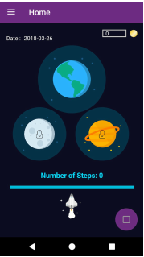
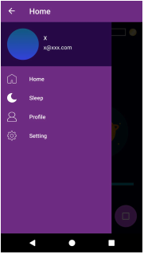
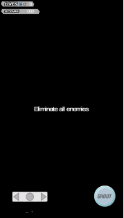
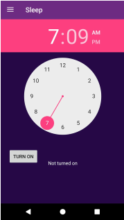
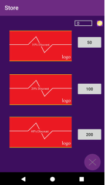
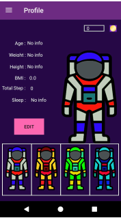
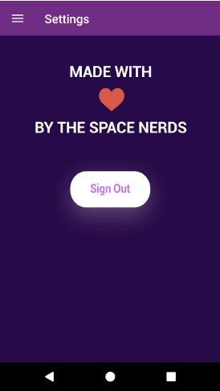

# healthcare_gamification_app
- An Android fitness app that motivate users to exercise more by using gamification

## Team members:
1. Loh Jin Xian
2. Yap Cheng Yee
3. Lim Way Shearn
4. Law Zhe Ming
5. Omar M. Hussein

## App functions 

- track the user's current location via GPS
- track the number of steps the user has taken
- track the user's caffeine intake 
- track the user's sleep duration 
- log in and sign up using Firebase 
- purchase vouchers using in game currencies from the in-app store
- a space invader game that features different spaceships and levels

## Screenshots

